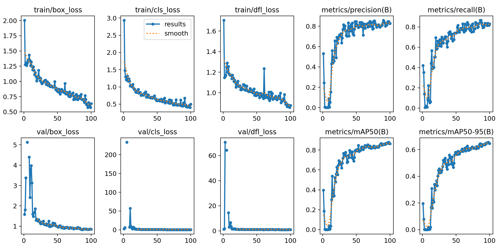
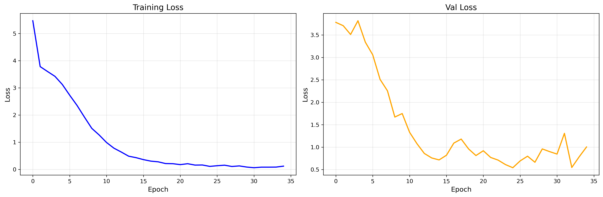

# OCR System - Text Recognition

## Overview

This OCR system uses a two-stage pipeline to recognize text from images:

- **Text Detection**: YOLOv11 is used to detect text regions
- **Text Recognition**: CRNN is used to recognize the content of the text

## Dataset

**Download Dataset**
Access and download the dataset from [Google Drive](https://drive.google.com/file/d/1kUy2tuH-kKBlFCNA0a9sqD2TG4uyvBnV/view).

---

## Processing Pipeline

```plaintext
Input Image → Text Detection (YOLOv11) → Text Recognition (CRNN) → Text Output
```

---

## System Requirements

### Environment Setup

```bash
pip install -r requirements.txt
```

---

## Stage 1: Text Detection

### Data Preprocessing

Convert XML annotations to YOLO format:

```bash
python xml_to_yolo.py
```

### Train YOLOv11

Start training the YOLOv11 detection model:

```bash
python -m Text_detection.YOLOv11
```

### YOLOv11 Results



---

## Stage 2: Text Recognition

### Data Preprocessing

Prepare image-text pairs for training:

```bash
python prepare_crnn_data.py
```

**Note:** This script processes the dataset into a CRNN-compatible format (images with corresponding labels only).

### Train CRNN

Start training the CRNN model:

```bash
python -m Text_recognition.CRNN
```

### CRNN Results



---

## Using the System

### Model Testing

Run the test notebook to evaluate both models:

```bash
jupyter notebook test.ipynb
```
